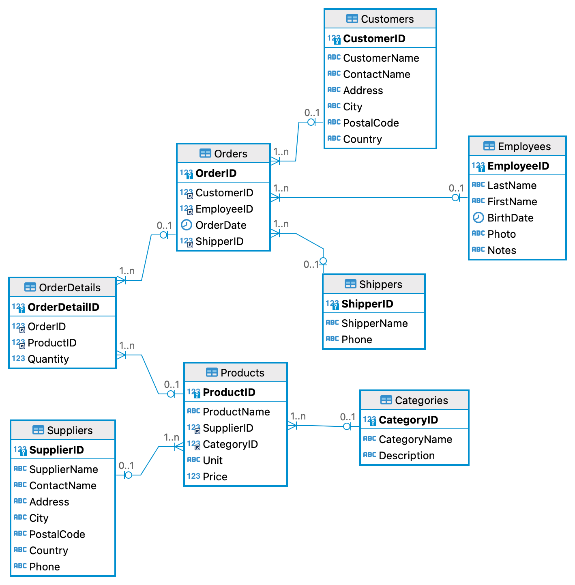

# Northwind Database

## Description

Create a database for a company called Northwind. The database will contain tables for products, suppliers, customers, employees, and orders. The database will also contain a table for order details. The database will be created using SQL Server Management Studio.

## Entity Relationship Diagram

The following is an entity relationship diagram for the Northwind database:

## Requirements

Create DDL scripts to create the database and tables for the Northwind database. Use the file `tasks.sql` to write the DDL scripts. The DDL scripts should create the tables and relationships shown in the entity relationship diagram.

## Submission

Submit the `tasks.sql` file containing the DDL scripts to create the Northwind database.

[tasks.sql](./tasks.sql)
